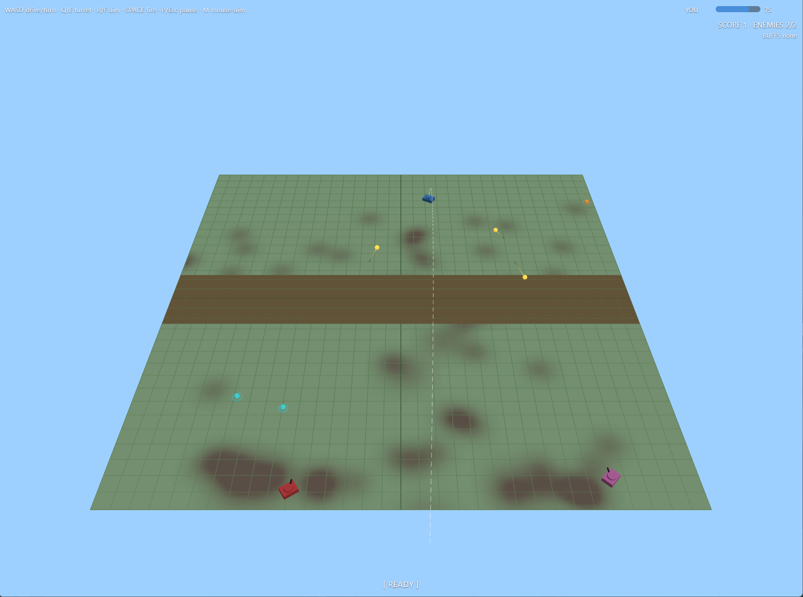

# Artillery Duel

A real-time, gravity-arced artillery duel built with [three.js](https://threejs.org/).
Drive a tank within your team's pen, slew your turret toward the enemy, and lob
slow, dodgeable shells across a no-man's-land. Impacts spawn expanding blasts
that crater the ground — and cratered ground slows everyone down, so the field
degenerates until someone lands the winning shot.



## Why this exists

This game is a playground for **AI-assisted game development in three.js**. The
point isn't shipping a product — it's exercising AI development workflows
(spec-driven planning, parallel agents, iterative feature work) while
incrementally building out real game features. Each feature starts as a short
plan in [`plans/`](plans/) and then gets implemented, played, and tuned.

## Features

- **Real-time artillery**, not turn-based — dodging is a skill, not a coin flip.
- **Teams & pens** — the map splits into team strips separated by a
  no-man's-land, keeping fights at ranged, aimable distances.
- **Explosion-first damage** — shells spawn expanding blasts; blast radius is a
  first-class, visible stat rather than a hidden hitbox.
- **Cratering ground** — impacts damage the terrain, and damaged ground slows
  tanks. Cumulative damage is the stalemate-breaker.
- **Powerups** — per-team speed and blast-radius buffs.
- **Mouse aim + left-click fire** (on by default; `M` toggles), or full keyboard.
- **Configurable** — survival (respawning enemies + difficulty ramp) or
  elimination (clear all enemies to win); random or strategic AI.
- …and more to come.

## Running it

No build step. three.js loads from a CDN via an [import map](index.html), and
the game uses ES modules — so **serve the directory over HTTP** (browsers block
module scripts over `file://`):

```bash
python3 -m http.server 8000
# then open http://localhost:8000
```

Tip: append `#debug` to the URL to expose `window.__game` for poking at the
live state from the console.

## Layout

```
index.html        canvas + HUD + import map (bare 'three' -> CDN) + error overlay
src/              all game modules
plans/            design plans by version
```

## Controls

WASD drive/turn · Q/E turret yaw · R/F elevation · SPACE **or** left-click fire ·
`M` toggle mouse aim · `P`/`Esc` pause · `1`/`2` configure (title screen) ·
Enter start/restart.

Quick gist — the in-game screens show the full, current control set.
